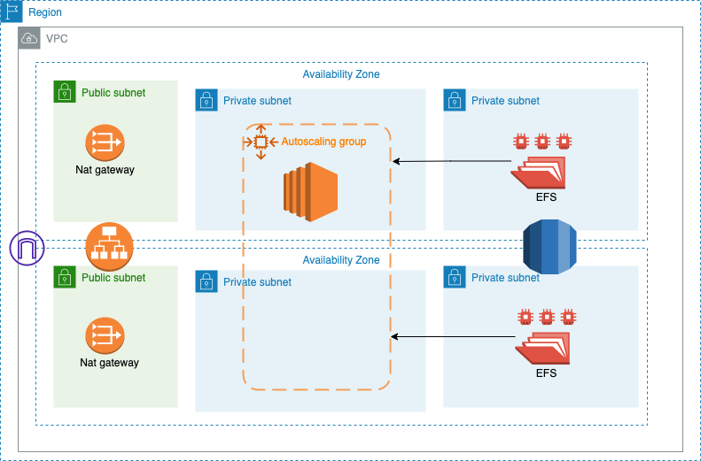

# demo-infra
A complete infra for a demo project

Architecture Diagram:



Usage:
```
terraform plan --var-file=prod.tfvars
terraform apply --var-file=prod.tfvars
```

aws ssm start-session --target $instanceid --document-name AWS-StartPortForwardingSession                        --parameters '{"portNumber":["22"],"localPortNumber":["9999"]}'
